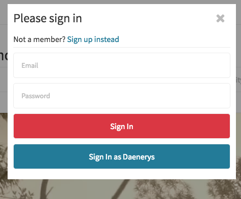

# OpenStable

[Live Version](http://www.openstable.site/)

OpenStable is a restaurant reservation web application with an [OpenTable](https://www.opentable.com/start/home) inspired user experience. It was built using a PostgreSQL server, Ruby on Rails backend, and a React.js frontend.

## Features

### Sign Up and Log In

OpenStable has a full end-to-end authentication system where users can sign up or log in and continue to use the site without a redirect. In order to improve the look of the sign up/log in process, I built a custom modal React component that I used for this purpose among other things. Because there were several React components that involved a modal, I also built a modal reducer in order to keep track of which component was visible at any given time. In addition, I used a Javascript timing event to give the appearance of typing when a user logs in as a guest.

A screen shot of the log in form is shown below.



### Restaurants

The key tables for this project were restaurants, tables, and bookings (the first two called stables and stalls on the front end to fit with the stable theme). Starting with restaurants, various restaurant details such as name and description are stored in a restaurant table in the database.

A few columns are of particular note: latitude, longitude, and hours. The latitude and longitude are computed upon creation of a restaurant based on the address using the [Geocoder](https://github.com/alexreisner/geocoder) gem. This allows for visualization of the restaurant on Google maps. In addition, hours are stored as an object with weekday names as keys and an array of times represented as strings as values. Storing times as an array allows for a restaurant to be open on multiple time blocks on a given day, giving more scheduling flexibility.

The basic CRUD operations are supported for restaurants, with two types of views for restaurants: a short index item view, and a more detailed view. The more detailed view displays the restaurant's location on a map using [Google maps](https://developers.google.com/maps/). Users can also click on a link to view a larger map, which uses the modal component discussed previously.

Below is a screen shot of the restaurant index view, which contains basic information about a restaurant like name, category, city, price, and average review score.


Below is a screen shot of part of the restaurant show view, which includes links that slide to the desired part of the page, a search form to search for reservations, a map of the restaurant location, photos, reviews, and an edit link if the user is the owner of the restaurant.


And below is a screen shot of the restaurant creation form time section, which allows for adding multiple time blocks and closing during a given day.


### Restaurant Categories and Cities

When viewing a given list of restaurants, users may filter the restaurants by category on the front end by clicking a set of toggle buttons that allows the user to select as many categories as they like. Users can also select a given city in the links on the home page or in the dropdown in the navigation bar.

### Tables

A restaurant has many tables, each with a name and a minimum and maximum number of seats (horses) it can accommodate. A user manages the tables in their restaurants by visiting their profile and viewing the tables of a selected restaurant. They can also create new tables as well as edit and delete existing ones with an inline form.

### Bookings

Each table has many bookings with an associated user, number of guest, and start time and date (the combination of which is stored as a DateTime). Users can search a particular restaurant or city for bookings on the home page, restaurant index page, or restaurant show page. Each restaurant can also choose their booking strategy from among four options:

* normal: offer the smallest table that accommodates the party
* generous: offer the largest table that accommodates the party
* greedy: offer only tables that are completely full
* hipster: report they are full 50% of the time, normal otherwise

Depending on the strategy, the associated tables of a given restaurant are searched and ordered accordingly, before examining the tables to determine which times +/- 1 hour around a desired time are available at the restaurant.

Below is the code to find the associated tables for a restaurant in the order dependent on the booking strategy, which involves calling a method to analyze the results to offer time slots around +/- 1 hour around a desired time.

```ruby
def table_availability(proposed_time, num_seats)
  order = "tables.max_seats ASC"
  seating = "? BETWEEN tables.min_seats AND tables.max_seats"

  order = "tables.max_seats DESC" if strategy == "generous"
  seating = "tables.max_seats = ?" if strategy == "greedy"

  result = Restaurant.includes(tables: [:bookings])
  .where(id: id)
  .where(seating, num_seats)
  .order(order)

  analyze_individual_result(result, proposed_time, num_seats)
end
```

Users can then view and cancel their bookings from their profile page.

### Search

Users can also search for restaurants and cities by name in the search bar. Whenever a user types into the search bar React component, the database is queried for restaurants. If the user is on a given city page, only the restaurants are searched, otherwise the supported city names are also searched. Below is the method from the [Restaurants Controller](./app/controllers/api/restaurants_controller.rb) that searches restaurants.

```ruby
def find_by_name
  if params[:query]
    queryString = "%#{params[:query]}%"

    if !params[:city].blank?
      @restaurants = Restaurant.where("name ILIKE ?", queryString).where(city: params[:city])

      render :query
    else
      @restaurants = Restaurant.where("name ILIKE ?", queryString)
      @cities = Restaurant::CITIES.select { |city| city[/.*#{params[:query]}.*/i] }

      render :query
    end
  else
    render json: {}
  end
end
```

A screen short of a user searching on the home page and seeing results is shown below.


### Reviews

Users can also leave reviews of restaurants, with all of the basic CRUD operations supported. The average overall review score for a restaurant is shown as part of the index item, while the breakdown into various components (food, service, value, etc.) is shown on the restaurant show page. Users then can add a review (if they have not reviewed a given restaurant yet) or edit and delete their previous review. Aggregate review scores are then recalculated on the front end to account for the change to the current user's review. Users can also see and edit all of their reviews on their profile page.

Below is a screen shot of a restaurant review form.


### Photos

Restaurants can upload and edit a profile picture. In addition, anyone can upload a photo for a given restaurant on that restaurant's show page. These photos also utilize the modal to allow users to see a larger version, complete with controls to flip forward and backward through all restaurant photos.

### Favorites

Users can also favorite and unfavorite restaurants. Each restaurant view contains a count of the number of users that have favorited that restaurant. A user can also view and remove favorites on their profile page.

### Form Errors

I also incorporated an errors reducer to keep track of errors associated with various forms. I use this data to conditionally render form error fields with styling that allows the user to more easily see and correct the error.

### Styling

As mentioned above, the styling of this site was inspired by [OpenTable](https://www.opentable.com/start/home). I used Sass to keep stylesheets and variables like colors DRY and easy to manage. The styling is fully responsive to look good on a variety of device widths.

### Future Directions

* Improve querying of restaurant review data
* Better handle invalid search input
* Points for using the site
